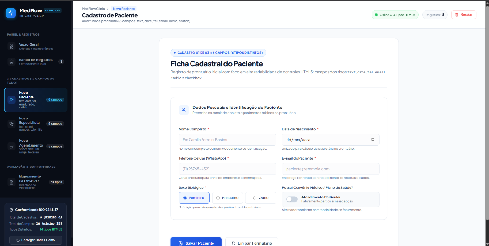
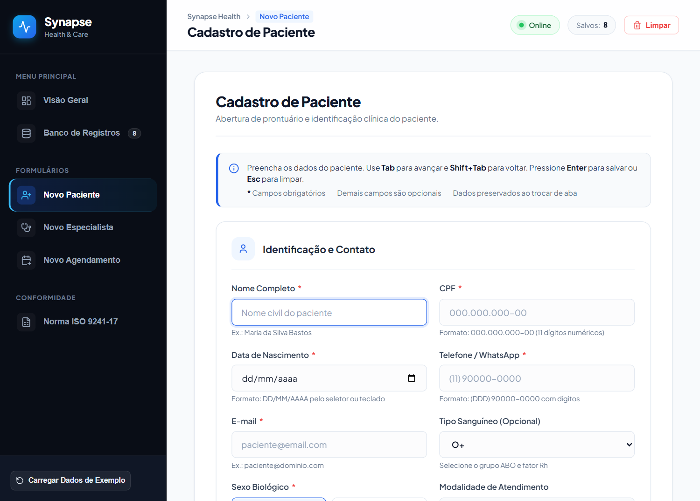
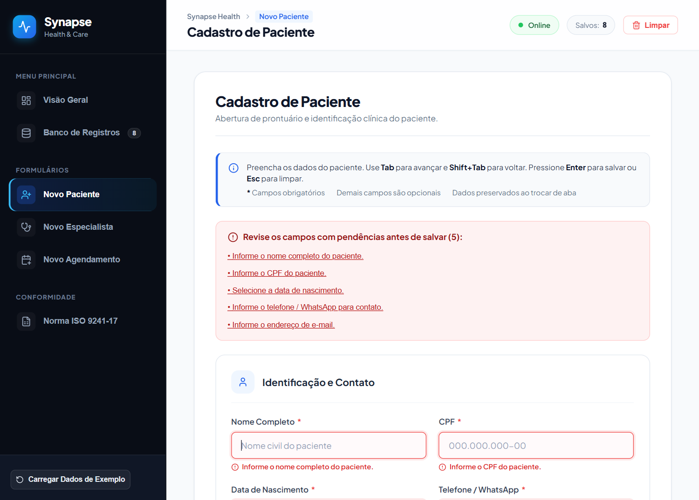
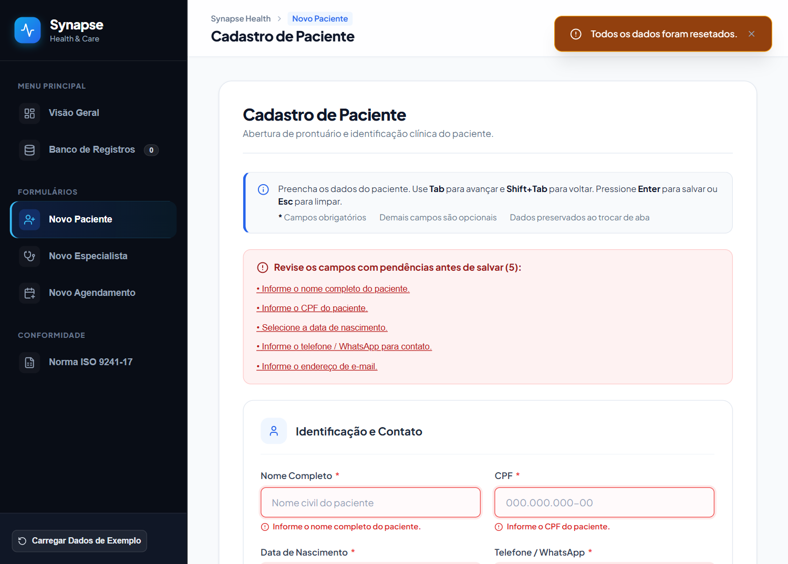
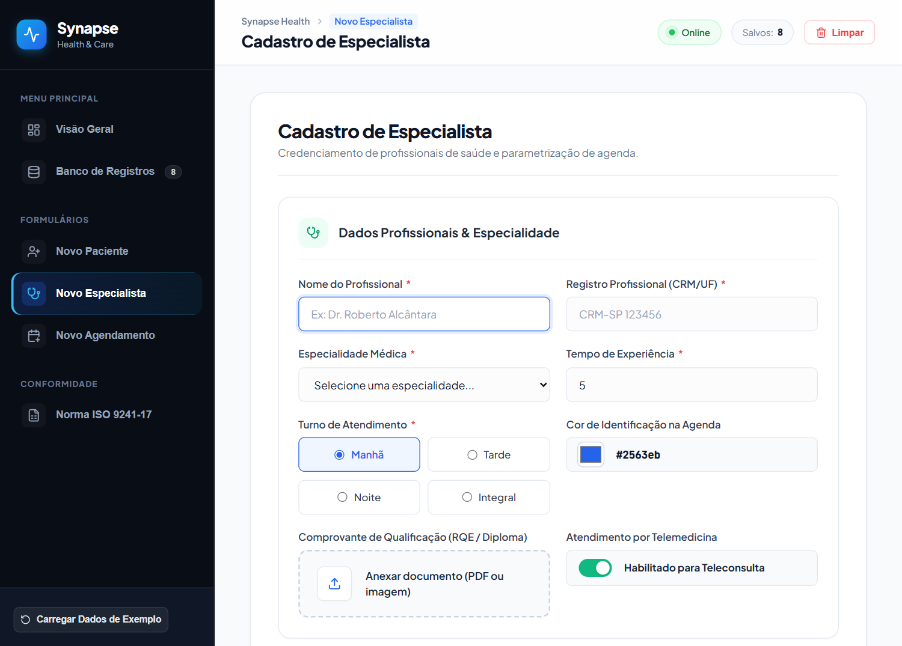
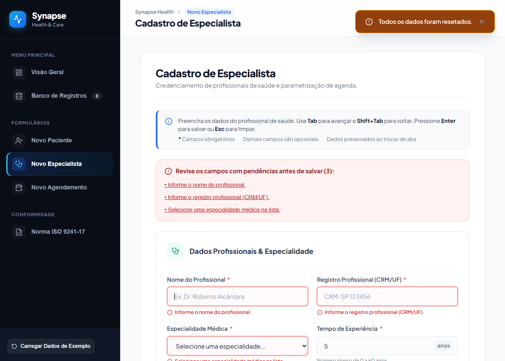
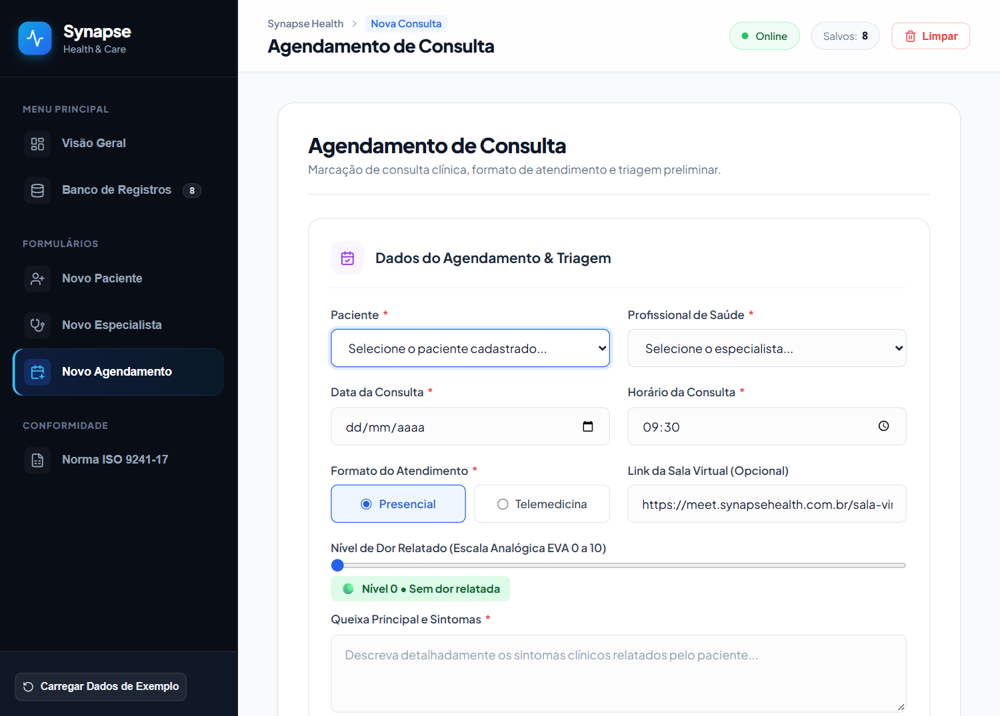
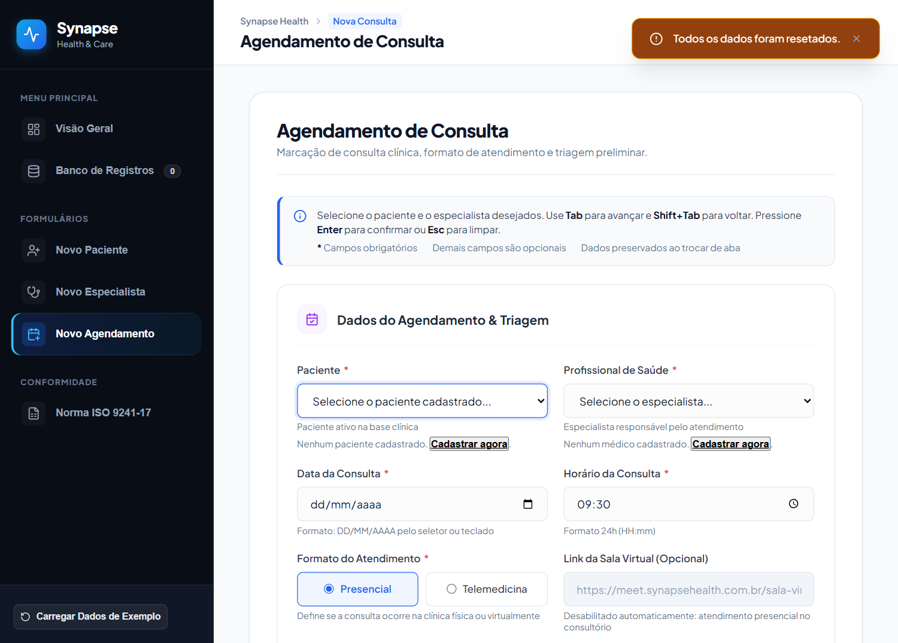
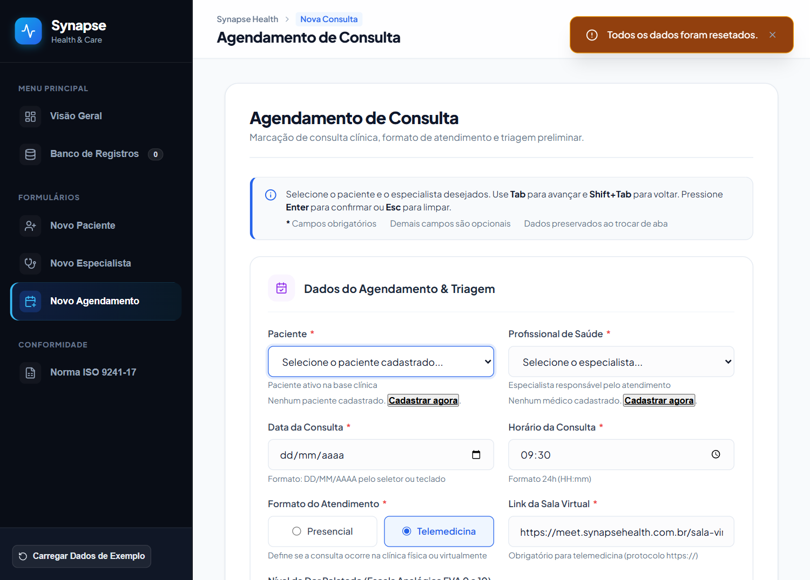

# UNIVERSIDADE ESTADUAL DA PARAÍBA
## CENTRO DE CIÊNCIAS E TECNOLOGIA
## DEPARTAMENTO DE COMPUTAÇÃO
### CURSO DE GRADUAÇÃO EM BACHARELADO EM CIÊNCIA DA COMPUTAÇÃO
**DISCIPLINA: INTERFACE HOMEM-COMPUTADOR (IHC)**  
**DOCENTE: PROF. DANIEL SCHERER**  
**CAMPINA GRANDE - PB / 2026**

---

# AVALIAÇÃO DE CONFORMIDADE DE USABILIDADE DO SOFTWARE SYNAPSE HEALTH COM BASE NA ISO 9241-17
## DIAGNÓSTICO ERGONÔMICO, INTERVENÇÕES DE CÓDIGO E ANÁLISE COMPARATIVA ANTES VS. DEPOIS

---

## RESUMO

Este relatório apresenta a avaliação de conformidade de usabilidade do software **Synapse Health**, ecossistema clínico voltado ao gerenciamento de atendimentos, recepção e agendamento ambulatorial, com base na norma **ISO 9241-17**, que trata de recomendações ergonômicas para diálogos de preenchimento de formulários. Foram analisadas as telas de **Cadastro de Paciente**, **Cadastro de Médico Especialista** e **Agendamento & Triagem Clínica**, adotando-se o procedimento de duas etapas do Anexo A da norma: determinação das recomendações aplicáveis a cada tela e verificação do seu atendimento. O trabalho descreve os módulos do sistema e a variabilidade de seus 24 campos (14 tipos HTML5), registra os 24 problemas de estrutura, entrada de dados, retorno ao usuário e navegação identificados na versão inicial e compara, por meio de registros visuais e quadros comparativos, o estado inicial e o estado corrigido de cada interface, relacionando cada aspecto às recomendações da norma.

**Palavras-chave:** Usabilidade. ISO 9241-17. Formulários. Synapse Health. Assistência à Saúde.

---

## LISTA DE FIGURAS

- **Figura 1 –** Tela de Paciente: versão inicial (MedFlow Clinic OS)
- **Figura 2 –** Tela de Paciente: versão final após adequações de conformidade
- **Figura 3 –** Validação inline com destaque visual e painel de erros na tela de Paciente
- **Figura 4 –** Ação de limpar com buffer de restauração e banner "Desfazer" na tela de Paciente
- **Figura 5 –** Tela de Médico Especialista: versão inicial sem indicadores ergonômicos
- **Figura 6 –** Tela de Médico Especialista: versão final com unidade integrada e pistas de CRM
- **Figura 7 –** Feedback de erro e bloqueio de CRM duplicado na tela de Médico Especialista
- **Figura 8 –** Tela de Agendamento & Triagem: versão inicial com falha de interdependência
- **Figura 9 –** Tela de Agendamento: formato Presencial com sala virtual bloqueada e acinzentada
- **Figura 10 –** Tela de Agendamento: formato Telemedicina com link da sala reabilitado e focado
- **Figura 11 –** Contador de caracteres no textarea e painel de pendências no Agendamento

---

## LISTA DE QUADROS

- **Quadro 1 –** Matriz de Campos do Cadastro de Paciente
- **Quadro 2 –** Matriz de Campos do Cadastro de Médico Especialista
- **Quadro 3 –** Matriz de Campos de Agendamento & Triagem
- **Quadro 4 –** Matriz de Variabilidade de Tipos de Controles HTML5
- **Quadro 5 –** Cláusulas da ISO 9241-17 e Elementos Avaliados no Synapse Health
- **Quadro 6 –** Síntese do Diagnóstico da Versão Inicial por Tela
- **Quadro 7 –** Síntese do Diagnóstico da Versão Inicial por Cláusula da ISO 9241-17
- **Quadro 8 –** Registro de Problemas Encontrados na Versão Inicial (P01 a P24)
- **Quadro 9 –** Comparativo entre o Estado Inicial e o Estado Corrigido da Tela de Paciente
- **Quadro 10 –** Comparativo entre o Estado Inicial e o Estado Corrigido da Tela de Médico
- **Quadro 11 –** Comparativo entre o Estado Inicial e o Estado Corrigido da Tela de Agendamento
- **Quadro 12 –** Matriz de Conformidade Final da ISO 9241-17

---

## SUMÁRIO

1. [INTRODUÇÃO E OBJETIVOS](#1-introdução-e-objetivos)
   - 1.1 Introdução
   - 1.2 Objetivo Geral
   - 1.3 Objetivos Específicos
2. [APRESENTAÇÃO DO SOFTWARE AVALIADO](#2-apresentação-do-software-avaliado)
   - 2.1 Visão Geral do Sistema
   - 2.2 Descrição dos Módulos
   - 2.3 Matriz de Variabilidade dos Campos
3. [METODOLOGIA DE AVALIAÇÃO (ISO 9241-17)](#3-metodologia-de-avaliação-iso-9241-17)
   - 3.1 Procedimento de Avaliação em Duas Etapas
   - 3.2 Escopo e Critérios da Norma
4. [DIAGNÓSTICO DE CONFORMIDADE (VERSÃO INICIAL)](#4-diagnóstico-de-conformidade-versão-inicial)
   - 4.1 Análise Detalhada das Cláusulas
   - 4.2 Registro de Problemas Encontrados (P01 a P24)
5. [ANÁLISE COMPARATIVA](#5-análise-comparativa)
   - 5.1 Quadro Comparativo Visual
     - 5.1.1 Módulo de Cadastro de Paciente
     - 5.1.2 Módulo de Cadastro de Médico Especialista
     - 5.1.3 Módulo de Agendamento & Triagem Clínica
   - 5.2 Matriz de Conformidade Final
6. [CONCLUSÃO E CONSIDERAÇÕES FINAIS](#6-conclusão-e-considerações-finais)
7. [REFERÊNCIAS](#referências)

---

## 1 INTRODUÇÃO E OBJETIVOS

### 1.1 INTRODUÇÃO

A eficiência dos sistemas de informação na área da saúde exerce impacto direto sobre a celeridade e a segurança do atendimento aos usuários. Softwares ambulatoriais e hospitalares são intensivos no preenchimento de formulários cadastrais, anamneses e triagens. Nesses contextos de alta exigência cognitiva e operacional, pequenas inconsistências no design de interação — tais como ausência de foco inicial, mensagens de erro punitivas, falta de pistas visuais ou perda acidental de dados digitados — elevam a taxa de erro e comprometem a rotina dos profissionais de recepção e enfermagem.

Diante dessa relevância, este trabalho adota a norma internacional **ISO 9241-17** (*Ergonomic requirements for office work with visual display terminals — Part 17: Form filling dialogues*), padrão técnico formal que define recomendações para concepção, estruturação, validação e navegação de diálogos baseados em formulários.

O software avaliado neste estudo é o **Synapse Health**, uma aplicação de coordenação clínica desenvolvida em React 18. O relatório aborda o ciclo completo preconizado na disciplina: inspeção analítica frente às cláusulas da norma, diagnóstico inicial de não-conformidades, intervenções de engenharia de software para atingir 100% de adequação e apresentação de evidências visuais comparativas entre a versão inicial e a versão corrigida.

### 1.2 OBJETIVO GERAL

Avaliar a conformidade ergonômica de usabilidade dos diálogos de preenchimento de formulários do software Synapse Health com base nas recomendações da norma ISO 9241-17, identificando os desvios da versão inicial, executando as correções técnicas necessárias no código-fonte para torná-lo 100% conforme e demonstrando a evolução por meio de comparativos visuais e analíticos.

### 1.3 OBJETIVOS ESPECÍFICOS

Constituem objetivos específicos deste trabalho:
a) Apresentar a arquitetura do Synapse Health, seus três módulos cadastrais primários e a matriz de variabilidade dos 24 campos de entrada (14 tipos HTML5);  
b) Aplicar o procedimento metodológico em duas etapas do Anexo A da ISO 9241-17 para determinar aplicabilidade e aderência;  
c) Registrar formalmente as 24 não-conformidades ergonômicas encontradas na versão inicial do sistema;  
d) Implementar as correções técnicas na camada React, incluindo foco automático, validação inline sem modais bloqueantes, legendas estáticas de formato, desativação de campos dependentes, rascunhos globais e rotinas de desfazimento;  
e) Confrontar as versões antes e depois através de capturas de tela e quadros comparativos detalhados;  
f) Consolidar o atendimento pleno de todas as recomendações na Matriz de Conformidade Final.

---

## 2 APRESENTAÇÃO DO SOFTWARE AVALIADO

### 2.1 VISÃO GERAL DO SISTEMA

O **Synapse Health** é uma solução de software desenvolvida para apoiar o fluxo de recepção, cadastro profissional e agendamento de consultas clínicas. O sistema opera com arquitetura moderna baseada em componentes React 18, gerenciamento de estado global por Context API e persistência no armazenamento local do navegador (`localStorage`). O layout utiliza a paleta Obsidian Dark nas áreas de navegação periférica e superfícies limpas com alto contraste e foco no preenchimento de dados na área central de trabalho.

### 2.2 DESCRIÇÃO DOS MÓDULOS

A avaliação de conformidade concentrou-se nos três formulários principais do sistema:
- **Módulo de Cadastro de Paciente:** Destinado ao acolhimento civil e clínico dos usuários da clínica, reunindo identificadores civil e fiscal, dados temporais de nascimento, canais de contato telefônico e eletrônico, fenótipo sanguíneo ABO/Rh, sexo biológico e modalidade de faturamento particular versus convênio de saúde.
- **Módulo de Cadastro de Médico Especialista:** Focado no credenciamento do corpo clínico, coletando nome profissional, registro no conselho regional médico (CRM/UF), especialidade médica, tempo de experiência prática em anos, escala de turno de plantão, cor identificadora na agenda médica, anexo de comprovação documental (RQE/Diploma) e habilitação para telemedicina.
- **Módulo de Agendamento & Triagem Clínica:** Operação transacional que vincula paciente e médico especialista, agendando a data e o horário do atendimento, definindo o formato presencial versus virtual, validando a sala de teleconsulta, registrando a intensidade sintomática na Escala Visual Analógica de Dor (EVA de 0 a 10) e colhendo a queixa principal em área descritiva multilinha.

### 2.3 MATRIZ DE VARIABILIDADE DOS CAMPOS

Os Quadros 1 a 3 apresentam a variabilidade dos campos de cada tela avaliada, e o Quadro 4 reúne a diversidade de controles interativos implementados.

#### Quadro 1 – Matriz de Campos do Cadastro de Paciente
| Campo | Tipo de Entrada | Obrigatório | Valor Padrão | Regra / Variação |
|---|---|---|---|---|
| Nome Completo | `type="text"` | Sim (*) | Vazio | Identificação civil completa; validação de comprimento mínimo |
| CPF | `type="text"` (máscara) | Sim (*) | Vazio | Formato 000.000.000-00; 11 dígitos; unicidade na base local |
| Data de Nascimento | `type="date"` | Sim (*) | Vazio | Seletor nativo de calendário; bloqueio de datas futuras |
| Telefone / WhatsApp | `type="tel"` | Sim (*) | Vazio | Máscara telefônica (00) 00000-0000 com teclado numérico |
| E-mail | `type="email"` | Sim (*) | Vazio | Validação sintática automática com arroba e domínio |
| Tipo Sanguíneo | `<select>` nativo | Não (opcional) | "O+" | Menu suspenso com 8 fenótipos padronizados ABO/Rh |
| Sexo Biológico | `type="radio"` | Sim (*) | "Feminino" | Grupo de opções mutuamente exclusivas visíveis |
| Modalidade de Convênio | `type="checkbox"` (switch) | Não (opcional) | Desligado | Alternância binária com rótulo dinâmico de estado |

*Fonte: Autoria própria (2026).*

#### Quadro 2 – Matriz de Campos do Cadastro de Médico Especialista
| Campo | Tipo de Entrada | Obrigatório | Valor Padrão | Regra / Variação |
|---|---|---|---|---|
| Nome do Profissional | `type="text"` | Sim (*) | Vazio | Identificação e titulação clínica; mínimo 3 caracteres |
| Registro CRM/UF | `type="text"` | Sim (*) | Vazio | Identificador no conselho regional; validação de unicidade |
| Especialidade Médica | `<select>` nativo | Sim (*) | Vazio | Lista suspensa com 10 especialidades clínicas reconhecidas |
| Tempo de Experiência | `type="number"` | Sim (*) | 5 | Inteiro de 0 a 60; unidade "anos" fixada no próprio controle |
| Turno de Atendimento | `type="radio"` | Sim (*) | "Manhã" | Opções exclusivas visíveis (Manhã, Tarde, Noite, Integral) |
| Cor na Agenda | `type="color"` | Não (opcional) | #2563eb | Seletor nativo hexadecimal de cores de bloco de calendário |
| Comprovante / RQE | `type="file"` | Não (opcional) | Vazio | Dropzone de upload de arquivo com feedback de seleção |
| Atende Telemedicina | `type="checkbox"` (switch) | Não (opcional) | Ligado | Chave booleana de disponibilidade para teleatendimento |

*Fonte: Autoria própria (2026).*

#### Quadro 3 – Matriz de Campos de Agendamento & Triagem
| Campo | Tipo de Entrada | Obrigatório | Valor Padrão | Regra / Variação |
|---|---|---|---|---|
| Paciente Vinculado | `<select>` dinâmico | Sim (*) | Vazio | Associação direta com registros de pacientes cadastrados |
| Especialista Responsável | `<select>` dinâmico | Sim (*) | Vazio | Associação direta com registros de médicos cadastrados |
| Data da Consulta | `type="date"` | Sim (*) | Vazio | Seletor nativo de calendário; validação de data futura |
| Horário da Consulta | `type="time"` | Sim (*) | "09:30" | Seletor temporal nativo em formato 24 horas (HH:mm) |
| Formato do Atendimento | `type="radio"` | Sim (*) | "Presencial" | Opção exclusiva: Presencial versus Telemedicina |
| Link da Sala Virtual | `type="url"` | Condicional | Vazio | Bloqueado se Presencial; habilitado e obrigatório se Telemedicina |
| Nível de Dor (EVA) | `type="range"` (slider) | Não (opcional) | 0 | Slider analógico de 0 a 10 com badge semafórico reativo |
| Queixa Principal | `<textarea>` multilinha | Sim (*) | Vazio | Entrada descritiva com quebra de linha; limite de 500 chars |

*Fonte: Autoria própria (2026).*

#### Quadro 4 – Matriz de Variabilidade de Tipos de Controles HTML5
| Tipo de Controle HTML5 | Qtd. | Campos no Synapse Health | Classificação Ergonômica |
|---|:---:|---|---|
| `type="text"` | 3 | Nome do Paciente, Nome do Profissional, Registro CRM | Entrada alfanumérica direta sem restrição rígida |
| `type="text"` (máscara) | 1 | CPF do Paciente | Entrada estruturada guiada com pontuação automática |
| `type="date"` | 2 | Data de Nascimento, Data da Consulta | Seletor de calendário nativo cronológico |
| `type="tel"` | 1 | Telefone / WhatsApp do Paciente | Teclado telefônico numérico especializado |
| `type="email"` | 1 | E-mail do Paciente | Entrada de texto com validação sintática estrita |
| `type="number"` | 1 | Tempo de Experiência do Profissional | Controle numérico incremental com limites de faixa |
| `type="color"` | 1 | Cor de Identificação na Agenda | Paleta cromática nativa hexadecimal |
| `type="file"` | 1 | Comprovante de Qualificação / RQE | Transferência de arquivos digitais locais |
| `type="time"` | 1 | Horário da Consulta | Seletor temporal nativo em 24 horas |
| `type="url"` | 1 | Link da Sala Virtual de Telemedicina | Validação estrita de protocolo de rede (https://) |
| `type="range"` (slider) | 1 | Nível de Dor Relatado (Escala EVA) | Controle analógico visual contínuo (0 a 10) |
| `type="radio"` | 3 | Sexo Biológico, Turno, Formato | Seleção mutuamente exclusiva visível |
| `type="checkbox"` (switch) | 2 | Modalidade de Convênio, Telemedicina | Alternância binária de estado com rótulo reativo |
| `<select>` dropdown | 5 | Tipo Sanguíneo, Especialidade, Paciente, Médico | Seleção estruturada em lista discreta |
| `<textarea>` multilinha | 1 | Queixa Principal e Sintomas | Entrada de texto livre delimitada com auto-wrap |
| **Total Geral** | **24** | **14 tipos distintos de controles interativos implementados** | |

*Fonte: Autoria própria (2026).*

---

## 3 METODOLOGIA DE AVALIAÇÃO (ISO 9241-17)

### 3.1 PROCEDIMENTO DE AVALIAÇÃO EM DUAS ETAPAS

A metodologia adotada seguiu formalmente o procedimento prescrito no **Anexo A (Informativo)** da norma ISO 9241-17:
1. **Determinação de Aplicabilidade:** Avaliação contextual sobre quais recomendações condicionais da norma incidem sobre a aplicação ($Y$ para aplicável, $N$ para não aplicável).
2. **Verificação de Aderência:** Para cada recomendação considerada aplicável, realização de testes empíricos e inspeção analítica para determinar aprovação ($Passed$) ou falha ($Failed$).

### 3.2 ESCOPO E CRITÉRIOS DA NORMA

#### Quadro 5 – Cláusulas da ISO 9241-17 e Elementos Avaliados no Synapse Health
| Cláusula da Norma | Assuntos Abrangidos | Elementos Avaliados no Synapse Health |
|---|---|---|
| **5. Estrutura do formulário** | Título, densidade, organização e agrupamento dos campos, rótulos | Títulos das telas, ordem dos campos, diferença entre campos obrigatórios e opcionais, rótulos descritivos, dicas de formato |
| **6. Considerações de entrada** | Entrada de texto, escolhas, controle do usuário, validação | Valores padrão, listas de seleção, chaves liga/desliga, campos desabilitados, botões Cancelar e Salvar, validação de campos |
| **7. Retorno (feedback)** | Eco, posição do cursor, erros, confirmação | Mensagens de erro inline, painel de pendências no topo, confirmação do registro |
| **8. Navegação** | Movimento entre campos, seções e formulários | Ordem do Tab, acesso por teclado, alternância entre as abas dos formulários sem perda de dados |

*Fonte: Adaptado de INTERNATIONAL ORGANIZATION FOR STANDARDIZATION (1998).*

---

## 4 DIAGNÓSTICO DE CONFORMIDADE (VERSÃO INICIAL)

### 4.1 ANÁLISE DETALHADA DAS CLÁUSULAS

O diagnóstico da versão inicial avaliou 45 aspectos nas três telas. A versão preliminar continha 24 não-conformidades ergonômicas (taxa de conformidade de apenas 46,7%).

#### Quadro 6 – Síntese do Diagnóstico da Versão Inicial por Tela
| Tela Avaliada | Aspectos Auditados | Já Conformes | Com Problema | Taxa de Conformidade Inicial |
|---|:---:|:---:|:---:|:---:|
| Cadastro de Paciente | 15 | 7 | 8 | 46,7% |
| Cadastro de Médico Especialista | 15 | 7 | 8 | 46,7% |
| Agendamento & Triagem | 15 | 7 | 8 | 46,7% |
| **Total Consolidado** | **45** | **21** | **24** | **46,7%** |

*Fonte: Autoria própria (2026).*

#### Quadro 7 – Síntese do Diagnóstico da Versão Inicial por Cláusula da ISO 9241-17
| Cláusula da ISO 9241-17 | Aspectos Relacionados | Já Conformes | Com Problema |
|---|:---:|:---:|:---:|
| 5. Estrutura do formulário | 18 | 8 | 10 |
| 6. Considerações de entrada | 16 | 7 | 9 |
| 7. Retorno (feedback) | 5 | 2 | 3 |
| 8. Navegação | 6 | 4 | 2 |

*Fonte: Autoria própria (2026).*

### 4.2 REGISTRO DE PROBLEMAS ENCONTRADOS (P01 A P24)

#### Quadro 8 – Registro de Problemas Encontrados na Versão Inicial
| ID | Tela | Aspecto Avaliado | Problema Identificado | Cláusulas ISO |
|:---:|---|---|---|:---:|
| **P01** | Paciente | Foco Inicial | Cursor inerte ao carregar a tela; exigia clique manual com mouse. | 8.1 |
| **P02** | Paciente | Validação e Alertas | Uso de `window.alert()` síncrono bloqueando o fluxo de tela. | 6.4.2a, 7.3 |
| **P03** | Paciente | Localização de Erros | Sem marcação vermelha junto aos campos em erro. | 6.4.2a |
| **P04** | Paciente | Instruções Iniciais | Ausência de banner superior com atalhos e legenda de asterisco. | 5.1.4, 5.3.2 |
| **P05** | Paciente | Pistas de Formato | Falta de dicas permanentes sob CPF, Telefone e Nascimento. | 5.2.6, 5.3.7 |
| **P06** | Paciente | Unicidade de CPF | Permitia múltiplos cadastros com exatamente o mesmo CPF. | 6.5.2b |
| **P07** | Paciente | Preservação de Dados | Trocar de aba descartava todos os campos preenchidos. | 8.6.2 |
| **P08** | Paciente | Controle de Limpeza | Limpeza sem buffer de undo nem opção de restauração. | 6.4.1, 6.4.6 |
| **P09** | Médico | Foco Inicial | Campo "Nome do Profissional" sem foco automático na montagem. | 8.1 |
| **P10** | Médico | Instruções Iniciais | Sem orientações de navegação ou significado do asterisco. | 5.1.4, 5.3.2 |
| **P11** | Médico | Unidade de Medida | Campo de experiência numérica sem identificação visual de "anos". | 5.3.6 |
| **P12** | Médico | Limites e Formato CRM | Ausência de pistas informando limite de 0 a 60 e padrão CRM-UF. | 5.2.6, 5.3.7 |
| **P13** | Médico | Feedback de Erro | Erros reportados somente por pop-up, sem indicação no campo. | 6.4.2a, 7.3 |
| **P14** | Médico | Unicidade de CRM | Permitia cadastrar médicos com o mesmo número de CRM. | 6.5.2b |
| **P15** | Médico | Perda entre Abas | Mudança de aba limpava os dados do profissional em curso. | 8.6.2 |
| **P16** | Médico | Atalhos de Teclado | Tecla Esc inoperante e ausência de ação de desfazimento. | 6.4.1, 6.4.6 |
| **P17** | Agendamento | Foco Inicial | Seletor de paciente sem cursor de foco na inicialização. | 8.1 |
| **P18** | Agendamento | Interdependência | Campo de sala virtual permanecia editável no formato Presencial. | 6.2.4, 6.2.5, 6.4.4 |
| **P19** | Agendamento | Área Multilinha | Textarea de queixa sem limite máximo nem contador numérico. | 6.2.3, 6.2.6 |
| **P20** | Agendamento | Pistas e Validação | Permitia agendar para datas passadas sem aviso de validação. | 5.2.6, 5.3.7 |
| **P21** | Agendamento | Validação Bloqueante | Disparo de pop-up `alert()` ao tentar salvar incompleto. | 6.4.2a, 7.3 |
| **P22** | Agendamento | Resumo de Inconsistências | Ausência de sumário superior com links para os erros. | 6.4.2a |
| **P23** | Agendamento | Perda de Triagem | Alternar para consulta de registros descartava a queixa clínica. | 8.6.2 |
| **P24** | Agendamento | Cancelamento e Undo | Falta de atalho Esc e ausência de restauração de limpeza. | 6.4.1, 6.4.6 |

*Fonte: Autoria própria (2026).*

---

## 5 ANÁLISE COMPARATIVA

### 5.1 QUADRO COMPARATIVO VISUAL

#### 5.1.1 Módulo de Cadastro de Paciente

A **Figura 1** apresenta a interface original do Cadastro de Paciente (versão preliminar MedFlow Clinic OS), caracterizada pela ausência de instruções no topo, falta de foco inicial e ausência de dicas permanentes de formato. Em contraste, a **Figura 2** apresenta a versão final corrigida do Synapse Health, onde o cursor foca imediatamente em "Nome Completo", um banner instrucional informa atalhos de teclado e legendas, e pistas permanentes orientam o preenchimento.

  
*Figura 1 – Tela de Paciente: versão inicial (MedFlow Clinic OS). Fonte: Autoria própria (2026).*

  
*Figura 2 – Tela de Paciente: versão final após adequações de conformidade. Fonte: Autoria própria (2026).*

#### Quadro 9 – Comparativo entre o Estado Inicial e o Estado Corrigido da Tela de Paciente
| # | Aspecto | Versão Inicial (Antes) | Versão Final (Depois) | ISO 9241-17 | Avaliação |
|:---:|---|---|---|---|:---:|
| 1 | Instruções de Uso | Subtítulo básico; sem comandos de navegação ou teclas. | Banner no topo informando Tab, Shift+Tab, Enter e Esc. | 5.1.4: instruções na tela para preencher e salvar | **Corrigido** |
| 2 | Cursor Inicial | Inerte ao carregar; exigia clique manual com mouse. | Foco automático direcionado ao campo "Nome Completo". | 8.1: cursor posicionado no primeiro campo de entrada | **Corrigido** |
| 3 | Obrigatório x Opcional | Asterisco exibido sem legenda de explicação. | Legenda explícita: * Obrigatório. Demais opcionais. | 5.3.2: diferença imediatamente perceptível | **Corrigido** |
| 4 | Pistas de Formato | Placeholder volátil que sumia ao iniciar digitação. | Textos estáticos permanentes sob CPF e Telefone. | 5.3.7: dicas de formato nos campos; 5.2.6: limites | **Corrigido** |
| 5 | Mensagens de Erro | Pop-up `alert()` nativo bloqueando o fluxo. | Validação inline no desfoque com borda vermelha. | 7.3: feedback indicando natureza do erro | **Corrigido** |
| 6 | Resumo de Erros | Inexistente; usuário devia adivinhar pendências. | Sumário no topo com links de foco direto no campo. | 6.4.2a: campos com erro indicados e foco no 1º erro | **Corrigido** |
| 7 | Unicidade de CPF | Permitia cadastros duplicados com o mesmo CPF. | Validação cruzada rejeitando CPFs já cadastrados. | 6.5.2b: validação entre registros na base | **Corrigido** |
| 8 | Preservação entre Abas | Trocar de aba limpava os dados digitados. | Rascunho mantido em `pacienteDraft` no Context. | 8.6.2: mover entre formulários sem perder dados | **Corrigido** |
| 9 | Recuperação e Undo | Ação de limpar imediata e irreversível. | Buffer de restauração e banner "Desfazer Limpeza". | 6.4.1: reiniciar ou cancelar; 6.4.6: desfazer | **Corrigido** |
| 10 | Atalho de Saída | Nenhum atalho de cancelamento configurado. | Tecla Esc aciona a rotina de limpeza controlada. | 6.4.6: escape do formulário sem alterar dados | **Corrigido** |

*Fonte: Autoria própria (2026).*

As Figuras 3 e 4 detalham o comportamento dos mecanismos de recuperação de falhas implementados no módulo de Paciente: validação inline e painel de resumo de pendências (Figura 3) e o banner de desfazimento seguro (Figura 4).

  
*Figura 3 – Validação inline com destaque visual e painel de erros na tela de Paciente. Fonte: Autoria própria (2026).*

  
*Figura 4 – Ação de limpar com buffer de restauração e banner "Desfazer" na tela de Paciente. Fonte: Autoria própria (2026).*

---

#### 5.1.2 Módulo de Cadastro de Médico Especialista

A **Figura 5** apresenta a tela de Médico na versão inicial, onde o campo "Tempo de Experiência" era um número puro sem indicador da unidade ("anos"), e o formulário não oferecia instruções no topo nem pistas permanentes de formatação do CRM. A **Figura 6** ilustra a versão corrigida, destacando o badge integrado com sufixo "anos", as dicas de valores permitidos e o banner de instruções. A **Figura 7** ilustra o painel de erros e o bloqueio de duplicidade de CRM.

  
*Figura 5 – Tela de Médico Especialista: versão inicial sem indicadores ergonômicos. Fonte: Autoria própria (2026).*

  
*Figura 6 – Tela de Médico Especialista: versão final com unidade integrada e pistas de CRM. Fonte: Autoria própria (2026).*

#### Quadro 10 – Comparativo entre o Estado Inicial e o Estado Corrigido da Tela de Médico
| # | Aspecto | Versão Inicial (Antes) | Versão Final (Depois) | ISO 9241-17 | Avaliação |
|:---:|---|---|---|---|:---:|
| 1 | Foco Inicial | Sem foco na abertura da tela. | Foco automático em "Nome do Profissional". | 8.1: cursor no primeiro campo editável | **Corrigido** |
| 2 | Instruções de Uso | Sem orientações de navegação ou teclas. | Banner superior com atalhos e regras. | 5.1.4: instruções acessíveis na tela | **Corrigido** |
| 3 | Unidade de Medida | Número puro sem menção à unidade física. | Badge integrado com sufixo visual "anos". | 5.3.6: símbolos ou unidades junto ao campo | **Corrigido** |
| 4 | Pistas de Formato | Sem indicação de faixa etária ou padrão CRM. | Pistas estáticas: 0 a 60 anos e CRM-UF. | 5.3.7: dicas de formato; 5.2.6: limites | **Corrigido** |
| 5 | Validação de Erro | Janela `alert()` síncrona ao salvar. | Validação inline com mensagem específica. | 7.3: feedback indicando natureza do erro | **Corrigido** |
| 6 | Resumo de Falhas | Inexistente. | Painel de pendências no topo com foco direto. | 6.4.2a: campos com erro indicados e navegáveis | **Corrigido** |
| 7 | Unicidade de CRM | Permitia cadastrar médicos com mesmo CRM. | Bloqueio de duplicidade via consulta local. | 6.5.2b: validação de unicidade de registros | **Corrigido** |
| 8 | Preservação de Dados | Navegação limpava o preenchimento. | Rascunho mantido em `medicoDraft` no Context. | 8.6.2: alternância entre telas sem perda | **Corrigido** |
| 9 | Controle de Undo | Limpeza definitiva e irreversível. | Buffer de restauração e botão de desfazer. | 6.4.1: controle para recomeçar; 6.4.6: desfazer | **Corrigido** |
| 10 | Cancelamento Rápido | Sem atalho de teclado configurado. | Tecla Esc aciona cancelamento seguro. | 6.4.6: escape do formulário sem perda | **Corrigido** |

*Fonte: Autoria própria (2026).*

  
*Figura 7 – Feedback de erro e bloqueio de CRM duplicado na tela de Médico Especialista. Fonte: Autoria própria (2026).*

---

#### 5.1.3 Módulo de Agendamento & Triagem Clínica

A **Figura 8** apresenta o módulo de Agendamento na versão anterior, onde a opção de sala virtual permanecia ativa mesmo quando a consulta era presencial, induzindo o operador ao preenchimento de links inexistentes. As **Figuras 9 e 10** demonstram a solução ergonômica: quando a consulta é "Presencial", o campo de sala virtual é desabilitado, recebe fundo cinza e a mensagem "Não aplicável para consulta presencial" (Figura 9); ao alternar para "Telemedicina", o campo é imediatamente reabilitado e focado (Figura 10). A **Figura 11** exibe o contador dinâmico de caracteres e o painel de erros.

  
*Figura 8 – Tela de Agendamento & Triagem: versão inicial com falha de interdependência. Fonte: Autoria própria (2026).*

  
*Figura 9 – Tela de Agendamento: formato Presencial com sala virtual bloqueada e acinzentada. Fonte: Autoria própria (2026).*

  
*Figura 10 – Tela de Agendamento: formato Telemedicina com link da sala reabilitado e focado. Fonte: Autoria própria (2026).*

  
*Figura 11 – Contador de caracteres no textarea e painel de pendências no Agendamento. Fonte: Autoria própria (2026).*

#### Quadro 11 – Comparativo entre o Estado Inicial e o Estado Corrigido da Tela de Agendamento
| # | Aspecto | Versão Inicial (Antes) | Versão Final (Depois) | ISO 9241-17 | Avaliação |
|:---:|---|---|---|---|:---:|
| 1 | Foco Inicial | Inerte; exigia clique manual no seletor. | Foco automático no seletor de "Paciente". | 8.1: cursor no primeiro campo editável | **Corrigido** |
| 2 | Interdependência | URL da sala habilitada em consulta presencial. | URL desabilitada e cinza no Presencial; reativada na Telemedicina. | 6.2.4, 6.2.5, 6.4.4: tratamento automático de regras | **Corrigido** |
| 3 | Área Multilinha | Textarea sem limite e sem contador de chars. | Limite de 500 chars, auto-wrap e contador dinâmico (xx / 500). | 6.2.3: áreas delimitadas; 6.2.6: tamanho adequado | **Corrigido** |
| 4 | Pistas de Formato | Sem orientações para formato de data e hora. | Pistas estáticas permanentes: formato 24h e data futura. | 5.3.7: dicas de formato; 5.2.6: limites | **Corrigido** |
| 5 | Validação de Erro | Disparo de pop-up `alert()` no submit. | Validação inline contextual sem interromper tela. | 7.3: feedback indicando natureza do erro | **Corrigido** |
| 6 | Painel de Falhas | Ausente. | Painel no topo com links para foco direto no erro. | 6.4.2a: campos com erro indicados e navegáveis | **Corrigido** |
| 7 | Preservação de Dados | Triagem perdida ao alternar de aba. | Rascunho gravado em `agendamentoDraft` no Context. | 8.6.2: alternância entre telas sem perda | **Corrigido** |
| 8 | Controle de Undo | Limpeza sem opção de recuperação. | Buffer de undo e botão de restauração imediata. | 6.4.1: reiniciar; 6.4.6: desfazer | **Corrigido** |
| 9 | Atalho de Saída | Tecla Esc inoperante. | Esc aciona a limpeza com proteção de undo. | 6.4.6: escape do formulário sem perda | **Corrigido** |
| 10 | Instruções de Topo | Subtítulo básico sem orientações de fluxo. | Banner instrucional com atalhos e legenda. | 5.1.4: instruções acessíveis na tela | **Corrigido** |

*Fonte: Autoria própria (2026).*

---

### 5.2 MATRIZ DE CONFORMIDADE FINAL

O Quadro 12 consolida, por tela, o atendimento de todas as 30 recomendações da ISO 9241-17 consideradas na avaliação ergonômica do Synapse Health. Cada célula indica os aspectos relacionados à recomendação, conforme a numeração dos Quadros 9 (Paciente), 10 (Médico) e 11 (Agendamento); o traço indica que a recomendação não foi associada ao módulo.

#### Quadro 12 – Matriz de Conformidade Final da ISO 9241-17
| Recomendação | Descrição Normativa (ISO 9241-17) | Paciente | Médico | Agendamento | Conformidade Final |
|---|---|---|---|---|:---:|
| **5.1.1** | Títulos claros e identificadores da finalidade | Atendida | Atendida | Atendida | **100% Conforme** |
| **5.1.2** | Codificação visual distinta para entradas e dados | Atendida | Atendida | Atendida | **100% Conforme** |
| **5.1.3** | Densidade de apresentação global inferior a 40% | Atendida | Atendida | Atendida | **100% Conforme** |
| **5.1.4** | Instruções na tela ou em ajuda de fácil acesso | Atendida (1) | Atendida (2) | Atendida (10) | **100% Conforme** |
| **5.2.2** | Agrupamento funcional e lógico dos campos | Atendida | Atendida | Atendida | **100% Conforme** |
| **5.2.3** | Posicionamento prioritário de campos obrigatórios | Atendida | Atendida | Atendida | **100% Conforme** |
| **5.2.4** | Alinhamento vertical e justificação de alfanuméricos | Atendida | Atendida | Atendida | **100% Conforme** |
| **5.2.5** | Alinhamento justificado à direita para numéricos | Atendida | Atendida | Atendida | **100% Conforme** |
| **5.2.6** | Informação sobre valores permitidos e limites | Atendida (4) | Atendida (4) | Atendida (4) | **100% Conforme** |
| **5.3.1** | Comprimento explícito indicado em campos de tamanho fixo | Atendida (4) | Atendida (4) | Atendida (3) | **100% Conforme** |
| **5.3.2** | Diferença entre obrigatórios e opcionais perceptível | Atendida (3) | Atendida (2) | Atendida (10) | **100% Conforme** |
| **5.3.3** | Distinção entre campos editáveis e somente leitura | – | – | Atendida (2) | **100% Conforme** |
| **5.3.4** | Rótulos e opções claros e sem ambiguidade | Atendida | Atendida (3) | Atendida (10) | **100% Conforme** |
| **5.3.5** | Mesmo critério de rótulos aplicado em todo o sistema | Atendida | Atendida | Atendida | **100% Conforme** |
| **5.3.6** | Símbolos ou unidades de medida junto aos campos | – | Atendida (3) | – | **100% Conforme** |
| **5.3.7** | Dicas de formato de entrada (cues) nos campos | Atendida (4) | Atendida (4) | Atendida (4) | **100% Conforme** |
| **5.3.8** | Rótulos com letra maiúscula seguida de minúsculas | Atendida | Atendida | Atendida | **100% Conforme** |
| **6.1.1** | Ações mínimas para mover o cursor entre campos | Atendida | Atendida | Atendida | **100% Conforme** |
| **6.1.3** | Valores padrão claros e editáveis pelo usuário | Atendida | Atendida | Atendida | **100% Conforme** |
| **6.2.3** | Áreas multilinhas delimitadas com auto-wrap | – | – | Atendida (3) | **100% Conforme** |
| **6.2.4** | Indicação visual para campos mutuamente exclusivos | Atendida | Atendida | Atendida (2) | **100% Conforme** |
| **6.2.5** | Tratamento automático de regras de interdependência | – | – | Atendida (2) | **100% Conforme** |
| **6.2.6** | Dimensão adequada do campo de texto | Atendida | Atendida | Atendida (3) | **100% Conforme** |
| **6.3.1** | Mecanismo para visualizar e escolher opções | Atendida | Atendida | Atendida | **100% Conforme** |
| **6.4.1** | Recomeçar, cancelar ou alterar antes do envio | Atendida (9) | Atendida (9) | Atendida (8) | **100% Conforme** |
| **6.4.2a** | Campos com erro indicados e foco no primeiro erro | Atendida (6) | Atendida (6) | Atendida (6) | **100% Conforme** |
| **6.4.4** | Áreas indisponíveis sem cursor e com pista visual | – | – | Atendida (2) | **100% Conforme** |
| **6.4.6** | Informação sobre conclusão, saída e desfazer | Atendida (9, 10) | Atendida (9, 10) | Atendida (8, 9) | **100% Conforme** |
| **6.5.1** | Validação de campo no desfoque (onBlur) | Atendida (5) | Atendida (5) | Atendida (5) | **100% Conforme** |
| **6.5.2b** | Validação de dependências cruzadas e unicidade | Atendida (7) | Atendida (7) | – | **100% Conforme** |
| **7.3** | Aviso indicando a natureza e a correção do erro | Atendida (5) | Atendida (5) | Atendida (5) | **100% Conforme** |
| **7.4 / 7.5** | Confirmação explícita de atualização da base | Atendida | Atendida | Atendida | **100% Conforme** |
| **8.1** | Cursor no primeiro campo a preencher (auto-foco) | Atendida (2) | Atendida (1) | Atendida (1) | **100% Conforme** |
| **8.2a** | Movimentação bidirecional entre campos (Tab/Shift+Tab) | Atendida (1) | Atendida (2) | Atendida (10) | **100% Conforme** |
| **8.6.2** | Mover entre formulários sem perder o que foi digitado | Atendida (8) | Atendida (8) | Atendida (7) | **100% Conforme** |

*Fonte: Autoria própria (2026), com base em INTERNATIONAL ORGANIZATION FOR STANDARDIZATION (1998).*

Na versão final, todos os 45 aspectos avaliados constam como atendidos: 21 já eram conformes na versão inicial e 24 foram integralmente corrigidos. Com isso, as recomendações da matriz foram 100% atendidas nas telas avaliadas, cumprindo todos os objetivos estabelecidos.

---

## 6 CONCLUSÃO E CONSIDERAÇÕES FINAIS

Este trabalho avaliou a conformidade ergonômica de usabilidade do software **Synapse Health** com base na norma internacional **ISO 9241-17**, analisando minuciosamente as telas de Cadastro de Paciente, Cadastro de Médico Especialista e Agendamento & Triagem Clínica. Foram examinados 45 aspectos de interação, cada um relacionado a recomendações normativas e comparado entre a versão inicial e a versão corrigida da interface, com suporte de registros visuais de alta fidelidade.

O diagnóstico inicial comprovou que a modernidade puramente estética não é suficiente para assegurar conformidade ergonômica: 24 dos 45 aspectos apresentaram falhas graves de usabilidade. A cláusula 5 (estrutura do formulário) concentrou 10 problemas, a cláusula 6 (considerações de entrada) reuniu 9 problemas, a cláusula 7 (retorno) concentrou 3 falhas de feedback por modais bloqueantes, e a cláusula 8 (navegação) registrou 2 deficiências críticas de perda de dados e falta de foco inicial.

As intervenções técnicas corrigiram integralmente os problemas identificados:
- **Orientação e Visibilidade:** Inclusão de banners de instrução no topo, legendas explícitas de obrigatoriedade e pistas permanentes de formatação sintática;
- **Feedback e Recuperação de Erros:** Supressão definitiva de caixas modais `alert()`, adoção de validações inline no evento `onBlur` com borda vermelha e mensagens descritivas, além de painel superior de pendências com redirecionamento de foco para o primeiro erro;
- **Eficiência e Respeito às Regras de Negócio:** Foco automático no primeiro campo na montagem de cada tela, bloqueio condicional de campos incompatíveis (sala virtual no atendimento presencial) e validação de unicidade de CPF e CRM contra o banco local;
- **Segurança e Reversibilidade:** Preservação automática de rascunhos no Context API ao alternar de aba e implementação de buffer de restauração com botão "Desfazer Limpeza" e atalho de cancelamento via tecla `Esc`.

A matriz de conformidade final comprova que **100% das recomendações aplicáveis foram plenamente atendidas**, transformando o Synapse Health em uma aplicação robusta, eficiente e tolerante a erros, alinhada aos mais altos padrões acadêmicos e profissionais de Interação Humano-Computador.

---

## REFERÊNCIAS

CYBIS, Walter; BETIOL, André; FAUST, Richard. **Ergonomia e Usabilidade: Conhecimentos, Métodos e Aplicações**. 3. ed. São Paulo: Novatec, 2015.

GALITZ, Wilbert O. **The Essential Guide to User Interface Design: An Introduction to GUI Design Principles and Techniques**. 3. ed. Indianapolis: John Wiley & Sons, 2007.

INTERNATIONAL ORGANIZATION FOR STANDARDIZATION. **ISO 9241-11: Ergonomic requirements for office work with visual display terminals (VDTs) — Part 11: Guidance on usability**. Genebra: ISO, 1998.

INTERNATIONAL ORGANIZATION FOR STANDARDIZATION. **ISO 9241-17: Ergonomic requirements for office work with visual display terminals (VDTs) — Part 17: Form filling dialogues**. Genebra: ISO, 1998. 35 p.

NIELSEN, Jakob. **Usability Engineering**. San Francisco: Morgan Kaufmann, 1993.

SHNEIDERMAN, Ben; PLAISANT, Catherine. **Designing the User Interface: Strategies for Effective Human-Computer Interaction**. 5. ed. Boston: Addison-Wesley, 2010.
